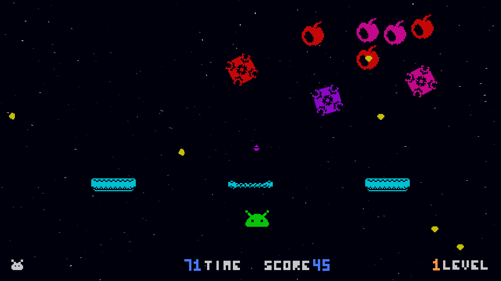
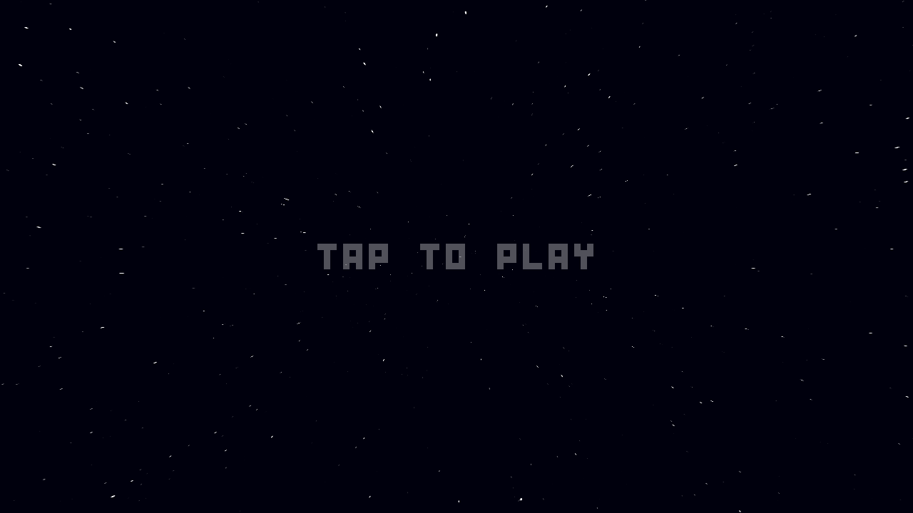

# Spacevaders - Gra mobilna inspirowana Space Invaders
## Opis gry
Gra inspirowana Space Invaders, w której sterujemy statkiem kosmicznym elminującym niebezpiecznych kosmitów chcących zniszczyć gracza przy pomocy pocisków. W celu przejścia poziomu gracz musi zniszczyć wszystkich kosmitów, którzy będą przywoływać swoich sprzymierzeńców o zróżnicowanych sposobach ataku. Po przejściu każdego poziomu gracz może ulepszyć jedną z 4 swoich statystyk:
- szybkość poruszania się,
- szybkość strzelania,
- wytrzymałość tarcz,
- liczba punktów życia (z którą gracza będzie zaczynał każdy następny poziom).
Gracz przegra jeżeli straci wszystkie punkty życia bądź zostanie dotknięty przez dowolnego przeciwnika (niezależnie od posiadanych punktów życia). Po przegranej gracz zaczyna grę od pierwszego poziomu.

## Technologia
- Godot Engine v1.3+

## Cel gry
- Zniszczenie wszystkich kosmitów (pozostałych przeciwników nie trzeba niszczyć).

## Wygląd gry

